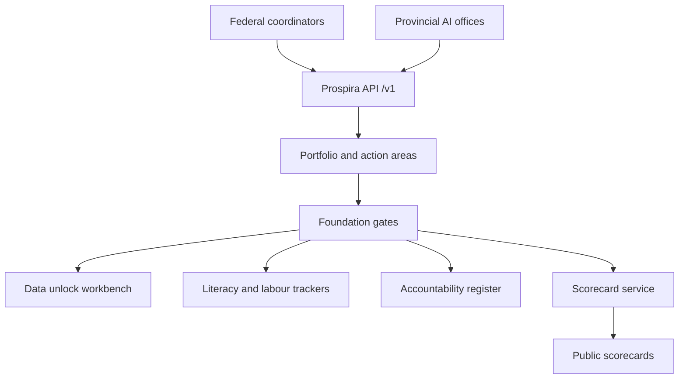

# Prospira

**Source:** `ai-in-gov/deloitte-ca-ai-imperative-public-policys-critical-moment-aoda-en/`
**Domain:** `ai-gov`
**One-liner:** Prospira is Canada’s AI prosperity operating system — coordinating federal and provincial action across fuelling the AI economy, preparing Canadians for change, and mitigating risk — with hard gates on data unlocking, AI literacy, and accountability systems before programmes claim progress.
**Wedge:** Federal ISED / innovation policy units and provincial AI strategy offices that already fund supply-side assets (Pan-Canadian AI Strategy, SCALE AI, provincial strategies) but need a shared demand-side and trust agenda — starting with data-strategy unlocks and public AI literacy tied to the Canada School of Public Service Digital Academy.
**Positioning:** A federated public-policy delivery system for “AI prosperity,” not another research-hub CRM. Deloitte’s third Canada AI imperative report argues Canada’s research and talent lead (CIFAR legacy; $125M Pan-Canadian AI Strategy; Quebec–federal $500M SCALE AI; Alberta’s $100M strategy) is necessary but insufficient while demand, literacy, and trust lag — only 4% of Canadians were confident in their understanding of AI in prior series research. Prospira operationalises the report’s three action areas and their foundational prerequisites.

## Market research synthesis

### Thesis from source

The report frames AI as a steam-engine-scale disruption and Canada as capable of world leadership if public policy acts now. AI prosperity is defined as productivity and government effectiveness gains, protection and opportunity for those negatively affected, and advancement of Canadian values (fairness, privacy, non-discrimination). Public policy sets the rules of the game; many frameworks predate digitisation, creating legal grey zones that chill business investment.

Three action areas structure the agenda. (1) Fuel the AI economy — create operating certainty, maintain the research lead, help firms commercialise and scale — founded on unlocking the value of data: IP reform for text-and-data mining / scraping clarity; machine-readable public data for commercial use; modernised privacy laws and data strategies; groundwork for data trusts with trustee diligence standards. Talent retention needs immigration fixes (e.g. startup visa expansion for AI). Capital and international customer access remain scale bottlenecks despite VCAP and related venture initiatives; a single window for scaleups via trade instruments is proposed. (2) Prepare Canadians for change — founded on AI literacy (Finland’s Elements of AI as a model; training for policymakers and judges; Digital Academy for civil servants), then equipping workers (Brookfield estimate that more than 40% of Canadian jobs are at risk from automation; Future Skills Centre’s $360M/6 years), and upgrading the social safety net (EI covering under 40% of unemployed vs ~85% thirty years ago; portable benefits). (3) Mitigate risk, build trust — founded on accountability and transparency systems, with modernisation of consumer protection, anti-discrimination application to AI, and standards leadership so Canadian values shape international norms.

The product is a cross-jurisdiction strategy OS that treats the three foundations as gates: programmes cannot report “green” on an action area while the foundation is unmet.

### Buyer & economic model

- Primary buyer: federal ADM-level sponsor for AI / data strategy coordinating with provincial AI offices; secondary buyers include municipal innovation offices contributing public data unlocks.
- Users: data-strategy and privacy policy leads; literacy programme managers; labour and EI policy leads; standards and accountability teams; research-hub liaison officers; scaleup/trade single-window operators.
- Budget owner / value metric: coordination cost against billions in federal/provincial AI and skills spend already committed. Value metric is share of funded initiatives that clear foundation gates, and movement in business adoption / public trust indicators the series tracks.
- Competing status quo: siloed federal programme trackers; provincial strategies that do not reconcile foundations; literacy pilots without population coverage metrics; accountability guidance that sits in PDF while departments deploy AI without a shared register.

### Domain constraints

- Regulatory / trust / safety: privacy law reform intersecting with GDPR/CCPA-driven corporate practice; Charter and human-rights constraints on automated decisions; federal–provincial division of powers on education, EI, and much commercial law.
- Data sensitivity: public data release for commercial AI must respect privacy and Indigenous data sovereignty where applicable; data-trust designs need fiduciary-grade controls.
- Change-management realities: supply-side institutions will resist being measured on demand outcomes; literacy programmes fail if treated as optional comms; EI reform is politically hard, so Prospira must track eligibility coverage gaps honestly rather than hide them behind skills-centre announcements.

## Business requirements

- BR-1: Every initiative maps to exactly one action area — fuel economy, prepare Canadians, or mitigate risk — and inherits that area’s foundation gate (data unlock, literacy, or accountability/transparency).
- BR-2: An action area cannot be reported as on-track while its foundation gate is red; the system refuses green status without recorded foundation evidence.
- BR-3: Data-unlock work items must specify instrument type — TDM/copyright exception progress, public dataset release, privacy statute reform, data-strategy principle, or data-trust guidance — with owners and jurisdictions.
- BR-4: Public dataset releases for commercial AI use record machine-readability, licence, and privacy review status; releases lacking machine-readable form do not count as unlocks.
- BR-5: AI literacy programmes record target population, completion, and whether content is general public, student, policymaker, or regulated profession (e.g. judges), so coverage is measurable rather than anecdotal.
- BR-6: Skills and safety-net initiatives must report EI-eligibility coverage implications explicitly, including gig and self-employed gaps, rather than only listing training seats.
- BR-7: Accountability and transparency systems register automated decision deployments seeking public trust claims, with a link to the governing directive or assessment used.
- BR-8: Federal and provincial (and where relevant municipal) contributions are first-class, with shared indicators and explicit non-participation noted — not assumed national coverage.
- BR-9: Research-hub and supercluster spend remains visible but cannot alone satisfy “fuel the AI economy” without demand-side and data-unlock evidence.
- BR-10: Scaleup support items track capital access and international customer-access actions separately, matching the dual bottleneck in the report.
- BR-11: Standards and international engagement tasks record whether domestic rules were set first, blocking empty “leadership abroad” claims.
- BR-12: Public prosperity scorecards publish foundation gate status beside programme spend, so citizens see trust prerequisites rather than only investment totals.

## User stories

Canonical user stories live in sibling [USER_STORIES.md](USER_STORIES.md).

## System design

### Overview

Prospira holds a federated AI prosperity portfolio. Initiatives are registered to action areas, blocked or advanced by foundation gates, and reported in public scorecards that show spend beside gate status. Data unlocks, literacy programmes, labour/EI reforms, accountability registers, and scaleup windows are first-class workflows with multi-jurisdiction ownership.

### Actors & boundaries

- Actors: federal and provincial coordinators; data/privacy leads; literacy and skills managers; accountability officers; research-hub liaisons; municipal data publishers; the public via scorecards.
- Trust boundary: Prospira coordinates policy delivery evidence — it is not the privacy regulator and not the AI model host. Sensitive labour microdata stays in statistical systems; Prospira stores indicators and programme records.
- Human-in-the-loop points: foundation gate clearance; public scorecard publication; cross-jurisdiction dispute on indicator definitions; registration of high-impact automated decision systems.

### Core capabilities

1. **Prosperity portfolio register** — initiatives by action area and jurisdiction.
2. **Foundation gates** — data unlock, literacy, accountability/transparency pass/fail with evidence.
3. **Data unlock workbench** — TDM/IP, public data releases, privacy reforms, data trusts.
4. **Literacy programme tracker** — audiences, completions, policymaker training.
5. **Labour and safety-net tracker** — skills seats, EI coverage metrics, portable benefits work.
6. **Accountability register** — automated decision deployments and assessment links.
7. **Scaleup single window** — capital and international customer-access actions.
8. **Federated participation map** — provincial/municipal coverage and gaps.
9. **Public scorecards** — spend vs foundation status.
10. **Standards readiness** — domestic-rules-first check on international claims.

### Conceptual data

- Primary entities: ProsperityStrategy, ActionArea, FoundationGate, Initiative, Jurisdiction, DataUnlockItem, PublicDatasetRelease, LiteracyProgramme, LabourInitiative, EiCoverageMetric, AccountabilityEntry, ScaleupCase, ScorecardRelease.
- Critical events: initiative registered; gate evidence filed; gate cleared/failed; dataset released; literacy cohort completed; accountability entry registered; scorecard published.
- Retention / audit needs: gate decisions and scorecards retained across electoral cycles for continuity; initiative history append-only.

### Integrations (conceptual)

- Systems of record: federal/provincial programme ledgers; open data portals; Canada School of Public Service learning systems; EI and Future Skills systems; TBS-style algorithmic assessment tools; trade/BDC scaleup services.
- Upstream signals: Pan-Canadian AI Strategy and SCALE AI reporting; provincial AI strategies; public trust and adoption surveys from the Deloitte series methodology.
- Downstream actions: budget challenge questions; public scorecards; grant conditionality; legislative reform trackers; single-window case routing.

### High-level architecture

### Success metrics

- Leading: share of initiatives with cleared foundation evidence; machine-readable public dataset releases; literacy completions by segment; accountability register coverage of known departmental AI systems.
- Lagging: business AI adoption and public confidence indicators; EI coverage rate for displaced workers; reduction in legal grey-zone complaints from AI firms; scaleup retention of AI talent in Canada.

## OpenAPI skeleton

Canonical HTTP surface lives in sibling [openapi.yaml](openapi.yaml). Summary:

- **Base path:** `/v1/...`
- **Auth:** `X-API-Key` for open-data and LMS connectors; Bearer JWT for policy operators.
- **Resource groups:** Strategies, Initiatives, Gates, DataUnlocks, Literacy, Accountability, Scorecards.
