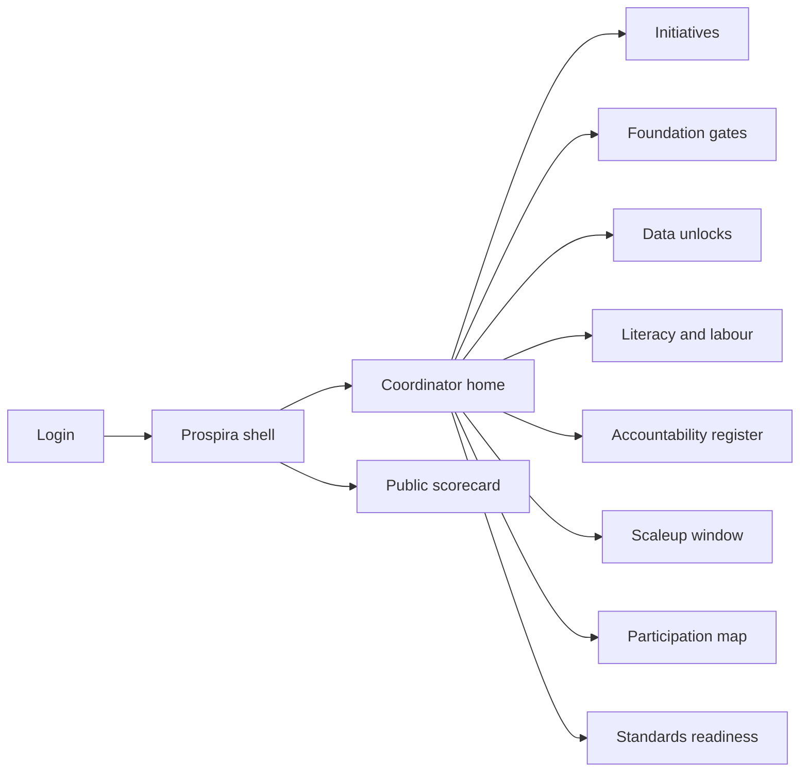
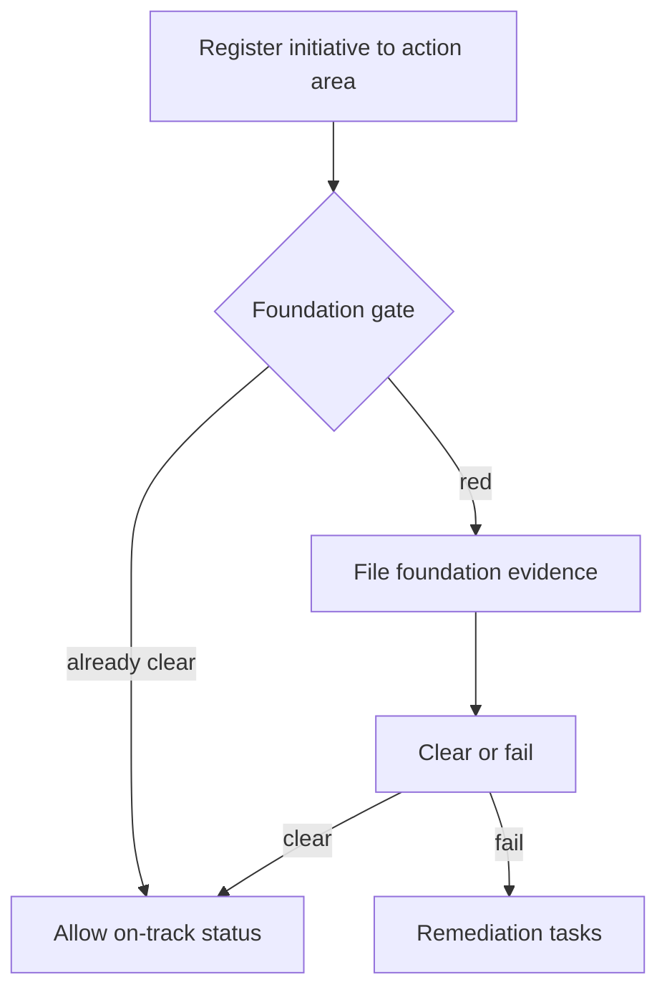

# Prospira — Web app

**Product:** [PRODUCT.md](./PRODUCT.md)
**Primary surface:** Federated AI prosperity strategy console (federal / provincial coordinators)
**Secondary surfaces:** Public prosperity scorecard; literacy programme ops; scaleup single-window caseboard
**Design thesis:** Prospira is Canada’s AI prosperity operating system with hard foundation gates — data unlock, literacy, and accountability — so research spend cannot paint the whole agenda green. The UI metaphor is a three-lane policy switchyard: every initiative sits in Fuel / Prepare / Mitigate and inherits that lane’s gate; green status is refused without recorded foundation evidence. Visual language is northern civic — deep Laurentian blue ground, ice-white panels, and maple-signal red only for gate failures and provincial coverage gaps — institutional without broadsheet clutter. The Prospira wordmark sits as a quiet federal–provincial coordination mark on every gate decision and public scorecard.

## UX research synthesis

### Category peers (best-in-class)

- **Canada Open Government / GC Infobase-style programme trackers:** Spend and results transparency. Steal: public scorecards beside investment totals; reject spend-only success stories.
- **Finland Elements of AI / Digital Academy programme dashboards:** Literacy completion by audience. Steal: segment completions (public vs civil service vs judges); reject anecdotal “we ran a course” as coverage.
- **TBS Algorithmic Impact Assessment / Directive registers (conceptual):** Accountability for automated decisions. Steal: register deployments claiming public trust; reject PDF guidance disconnected from live systems.
- **Provincial AI strategy portals (Quebec, Alberta et al.):** Multi-jurisdiction visibility. Steal: explicit non-participation flags; reject assumed national coverage.

### Patterns to adopt / reject

- **Adopt:** Exactly one action area per initiative; foundation gate blocks on-track claims; machine-readable public data as unlock currency; literacy by audience segment; EI coverage beside skills seats; accountability register; capital vs export tracks for scaleups; domestic-rules-first on standards; federated participation map.
- **Reject:** Hub/supercluster spend alone greening “fuel economy”; PDF open data as unlock; 4%-confidence problem ignored; empty “leadership abroad”; purple AI nation branding; dashboard-of-everything without gates.

### Trust, density, and workflow constraints from PRODUCT.md

Federal–provincial division of powers means non-participation must show (BR-8). Public commercial data releases need machine-readability + privacy review (BR-4). EI gaps must stay visible beside training announcements (BR-6). Scorecards publish gates beside spend so citizens see trust prerequisites (BR-12). Prospira coordinates evidence — it is not the privacy regulator or model host.

## Information architecture

### Nav model

### Roles → default home

| Role | Default home | Why |
|------|--------------|-----|
| Federal / provincial coordinator | Coordinator home — gate status | Refuse false green (BR-2) |
| Data strategy / privacy lead | Data unlocks | Machine-readable releases (BR-3, BR-4) |
| Literacy / skills manager | Literacy and labour | Segment completions + EI gaps (BR-5, BR-6) |
| Accountability / standards officer | Accountability + standards | Trust systems + domestic rules first (BR-7, BR-11) |
| Scaleup / trade operator | Scaleup window | Capital vs customers (BR-10) |
| Research-hub liaison | Portfolio (fuel lane) | Visible but cannot alone clear fuel (BR-9) |
| Public | Public scorecard | Spend vs foundations (BR-12) |

### Cross-links to OpenAPI resources

| Nav area | OpenAPI tags / resources |
|----------|---------------------------|
| Prosperity strategies | Strategies |
| Action-area initiatives | Initiatives |
| Data / literacy / accountability gates | Gates |
| TDM, datasets, trusts, privacy reform | DataUnlocks |
| Literacy programmes | Literacy |
| Automated decision register | Accountability |
| Public prosperity scorecards | Scorecards |

## Screen inventory

### Coordinator home

- **Purpose:** Show which action areas are blocked by red foundations and which initiatives lack evidence.
- **Entry:** Coordinator login.
- **Layout regions:** Brand + jurisdiction switcher; three action-area lanes with gate lamps; blocked on-track attempts; provincial gap alerts; upcoming scorecard publish.
- **Primary actions:** Open gate evidence; refuse/clear gate; drill initiative.
- **Empty / loading / error:** New strategy = seed three areas + foundation checklists.
- **BR / story ties:** BR-1, BR-2, BR-8.

### Initiative portfolio

- **Purpose:** Register initiatives to exactly one action area with jurisdiction owners.
- **Entry:** Portfolio nav.
- **Layout regions:** Filterable table; action-area tag; inherited gate; research-hub flag; demand-side evidence slots for fuel lane.
- **Primary actions:** Create initiative; re-tag area (with audit); link gate evidence.
- **Empty / loading / error:** Untagged = cannot save; hub-only fuel claim = amber BR-9 warning.
- **BR / story ties:** BR-1, BR-9.

### Foundation gates board

- **Purpose:** Pass/fail data unlock, literacy, accountability with recorded evidence; refuse green action-area status otherwise.
- **Entry:** Gates nav; home lamps.
- **Layout regions:** Three gate cards; evidence checklist; clear/fail decisions; dependent initiatives list.
- **Primary actions:** File evidence; clear gate; fail with remediation.
- **Empty / loading / error:** Attempt on-track without clear = system refuse (BR-2).
- **BR / story ties:** BR-2.

### Data unlock workbench

- **Purpose:** Track TDM/IP, public releases, privacy reform, strategy principles, data-trust guidance by jurisdiction.
- **Entry:** Data unlocks.
- **Layout regions:** Instrument-type board; dataset release table (machine-readable, licence, privacy); trust diligence standards tracker.
- **Primary actions:** Add unlock item; publish release only if machine-readable + privacy reviewed; advance trust guidance.
- **Empty / loading / error:** PDF dump = does not count (BR-4).
- **BR / story ties:** BR-3, BR-4.

### Literacy and labour tracker

- **Purpose:** Completions by audience segment; EI coverage gaps beside skills seats.
- **Entry:** Literacy nav.
- **Layout regions:** Programme list; audience segments (public, student, policymaker, judges, Digital Academy); completion charts; EI coverage panel; portable benefits work items.
- **Primary actions:** Record cohort; update EI metric; attempt prepare-lane on-track (refused without literacy evidence).
- **Empty / loading / error:** Civil-service-only completions cannot claim population literacy.
- **BR / story ties:** BR-5, BR-6.

### Accountability register

- **Purpose:** Register automated decision deployments that claim public trust, with directive/assessment link.
- **Entry:** Accountability nav.
- **Layout regions:** System register; assessment basis; owning department; public-trust claim flag.
- **Primary actions:** Register; link AIA/directive; flag unregistered known systems.
- **Empty / loading / error:** Trust claim without register entry = blocked on scorecard narrative.
- **BR / story ties:** BR-7.

### Scaleup single window

- **Purpose:** Separate capital-access and international customer-access actions per firm journey.
- **Entry:** Scaleup nav.
- **Layout regions:** Caseboard; dual tracks; bottleneck indicator; trade instrument links.
- **Primary actions:** Open case; log capital vs export action; escalate bottleneck.
- **Empty / loading / error:** Single conflated “support” field = validation error.
- **BR / story ties:** BR-10.

### Federated participation map

- **Purpose:** Show federal/provincial/municipal contributions and explicit non-participation.
- **Entry:** Fed map.
- **Layout regions:** Jurisdiction map/list; indicator coverage; gap flags.
- **Primary actions:** Record participation; note non-participation; align indicator definitions.
- **Empty / loading / error:** Assumed coverage suppressed — gaps must show (BR-8).
- **BR / story ties:** BR-8.

### Standards readiness

- **Purpose:** Domestic-rules-first check before “international leadership” completion.
- **Entry:** Standards nav.
- **Layout regions:** Domestic gap list; international engagement tasks; completion locked while gaps open.
- **Primary actions:** Close domestic gap; then mark international task complete.
- **Empty / loading / error:** Abroad-complete while domestic open = blocked (BR-11).
- **BR / story ties:** BR-11.

### Public prosperity scorecard

- **Purpose:** Publish foundation gate status beside programme spend.
- **Entry:** Public link; publish flow.
- **Layout regions:** Spend totals; three gate lamps; literacy/trust indicators; methodology; jurisdiction gaps.
- **Primary actions:** Download; share; deep-link to machine-readable unlocks.
- **Empty / loading / error:** Unpublished = “scorecard not released.”
- **BR / story ties:** BR-12.

## Key flows

1. **Clear a foundation gate** — file evidence → review → clear/fail → unlock on-track for dependent initiatives; failure: green refused (BR-2).

2. **Count a data unlock** — propose release → machine-readable + privacy review → count; PDF fails (BR-4).

3. **Prepare-Canadians honesty** — record literacy by segment → show EI coverage gaps → only then claim progress (BR-5, BR-6).

4. **Scaleup bottleneck** — open firm case → log capital and export actions separately → see dominant bottleneck (BR-10).

5. **Publish scorecard** — lock gate states + spend → show gaps → publish (BR-12).

## Design system

### Tokens (CSS variables)

- `--color-ink: #E8EEF4` — text on deep ground
- `--color-laurentian-950: #0B1524` — app ground
- `--color-laurentian-900: #142236` — panels
- `--color-ice: #F3F6FA` — scorecard/light panels
- `--color-signal: #C8102E` — gate fail / coverage gap (sparingly)
- `--color-ok: #2A8F6E` — gate clear
- `--color-amber: #D4943A` — evidence incomplete
- `--color-steel: #8AA0B5` — secondary
- `--color-brand: #5B7FA6` — Prospira wordmark
- `--font-display: "Libre Franklin", sans-serif` — strategy titles
- `--font-body: "Source Sans 3", sans-serif`
- `--font-mono: "IBM Plex Mono", monospace` — initiative and gate ids
- `--space-1`…`--space-8`: 4px scale
- `--radius-sm: 4px`; `--radius-md: 8px`
- `--motion-gate: 200ms ease-out` — clear/fail stamp
- `--motion-refuse: 180ms ease-in` — on-track refuse
- `--motion-publish: 240ms linear` — scorecard release
- Atmosphere: soft aurora-neutral gradient (cool, desaturated — not neon); faint federation grid; no maple sticker spam; no purple nation-AI clichés.

### Typography & brand

- Display for action-area names; body for policy prose; mono for ids.
- Brand on gates and public scorecard; coordinator chrome keeps brand as strongest mark.
- Login: brand hero; headline (“Foundations first. Then prosperity claims.”); one CTA.

### Do / don’t

- **Do:** Three gates with force; machine-readable unlocks; literacy segments; EI honesty; federated gaps; domestic rules first.
- **Don’t:** Greenwash with hub spend; PDF-as-data; empty global leadership; purple glow; single composite prosperity %.

### Accessibility & domain trust cues

- AA+; gate state always textual.
- Live regions for gate clear/fail and scorecard publish.
- Focus order: portfolio → gates → unlocks/literacy/accountability → scorecard.
- Public scorecard bilingual-ready layout (EN/FR structure).

## Component patterns

- **ActionAreaLane** — Fuel / Prepare / Mitigate with inherited gate lamp.
- **FoundationGateCard** — evidence checklist + clear/fail.
- **OnTrackRefuseToast** — system refusal when foundation red.
- **MachineReadableUnlockRow** — release that counts.
- **LiteracySegmentChart** — completions by audience.
- **EiCoverageBesideSkills** — dual honesty panel.
- **AccountabilityEntry** — ADS + assessment link.
- **ScaleupDualTrack** — capital vs export.
- **ParticipationGapMap** — explicit non-participation.
- **ProsperityScorecard** — spend beside foundations.

## Out of scope for v1 web

- Running AI models; replacing ISED grant payment systems; full EI case administration; partisan campaign tools; municipal 311 replacement.
